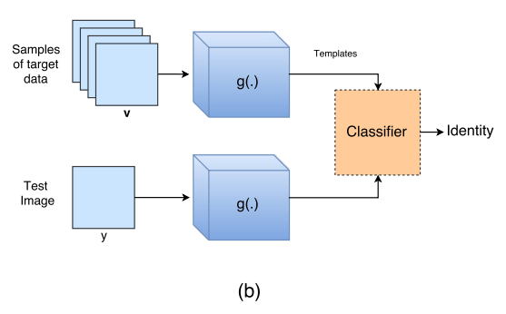
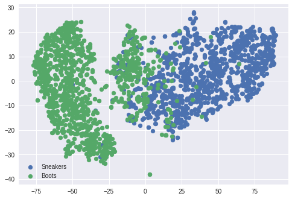
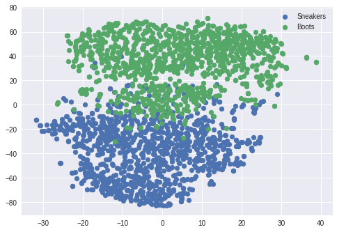
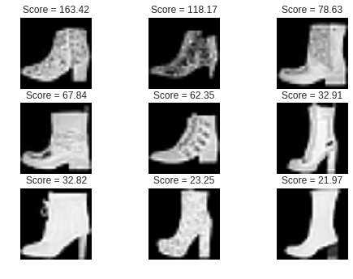
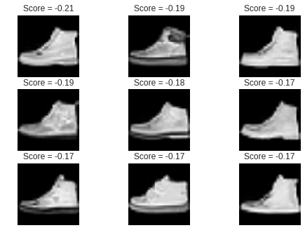
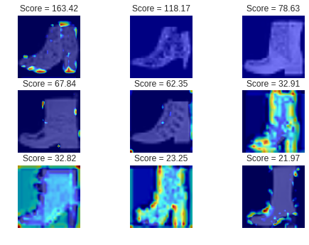
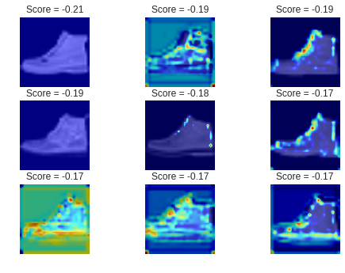
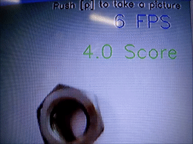
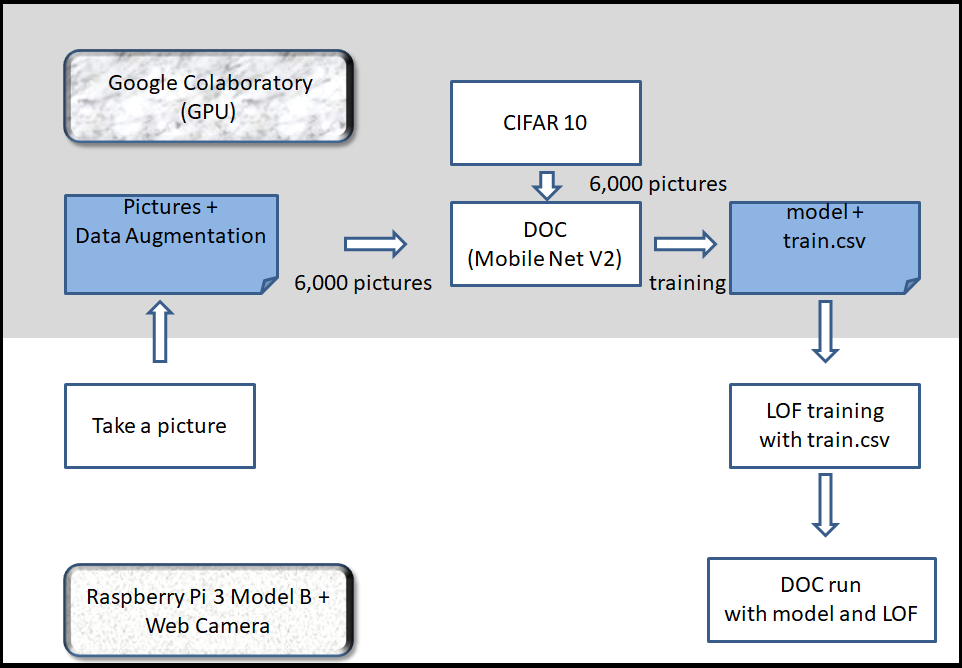

# Keras-OneClassAnomalyDetection
Learning Deep Features for One-Class Classification(AnomalyDetection).  
  
**[Jan 06, 2019] Start of work. Under construction.**  

# Introduction
This repository was inspired by **[Image abnormality detection using deep learning ーPapers and implementationー - Qiita - shinmura0](https://qiita.com/shinmura0/items/cfb51f66b2d172f2403b)**, **[Image inspection machine for people trying hard - Qiita - shinmura0](https://qiita.com/shinmura0/items/7f4298b75d6b788bba80)** and was created.    
I would like to express my deepest gratitude for having pleasantly accepted his skill, consideration and article quotation.  
His articles that were supposed to be used practically, not limited to logic alone, are wonderful.  
However, I don't have the skills to read papers, nor do I have skills to read mathematical expressions.  
I only want to verify the effectiveness of his wonderful article content in a practical range.  

# Environment (example)
1. Ubuntu 16.04
2. Geforce GTX 1070
3. Python 3.5
4. Tensorflow-gpu 1.12.0
5. Keras 2.2.4
6. numpy 1.15.3
7. matplotlib 3.0.1
8. PIL 5.3.0
9. OpenCV 4.0.1-openvino
10. sklearn 0.20.0

# Translating shinmura0's article
## 1. Introduction
There are many methods such as methods using **"[Implemented ALOCC for detecting anomalies by deep learning (GAN) - Qiia - kzkadc](https://qiita.com/kzkadc/items/334c3d85c2acab38f105)"** and methods using **"[Detection of Video Anomalies Using Convolutional Autoencoders and One-Class Support Vector Machines (AutoEncoder)](http://cbic2017.org/papers/cbic-paper-49.pdf)"** for image anomaly detection using deep learning.  
Here is an article on detecting abnormality of images using "Variational Autoencoder".  
**[Image abnormality detection using Variational Autoencoder (Variational Autoencoder) - Qiita - shinmura0](https://qiita.com/shinmura0/items/811d01384e20bfd1e035)**  

The method to be introduced this time is to detect abnormality by devising the loss function using normal convolution neural network(CNN).  
  
「Learning Deep Features for One-Class Classification」 (Subsequent abbreviations, DOC)  
**arxiv：　https://arxiv.org/abs/1801.05365**  
  
  
  
In conclusion, it was found that **this method has good anomaly detection accuracy** and visualization of abnormal spots is also possible.  

## 2. Overview
This paper states that it achieved state-of-the-art at the time of publication.  
In the figure below, we learned under various conditions using normal CNN and visualized the output from the convolution layer with t-SNE.  
  

  
- Figure (b): Alexnet's learned model with Normal and Abnormal distributed
- Figure (c): Diagram learned with Normal vs Abnormal
- Figure (e): Proposed method (DOC)

I think that it is not only me that thinking that abnormality can be detected also in figure (b).  
However, it is somewhat inferior to figure (e).  
  
In the thesis, it finally uses "k neighborhood method" in (e) to detect abnormality.  
As a learning method, view the images that you want to detect abnormality at the same time, completely different kinds of images, and narrow down the range of the images for which you want to detect anomalies.  

## 3. Preparing data
For learning, prepare the following data.  

|Dataset name|Contents|Concrete example|Number of classes|
|:--|:--|:--|:-:|
|Target data|Image you want to detect abnormality|Product etc.|1|
|Reference data|A data set not related to the above|ImageNet and CIFAR-10|10 or 1,000 or more|

## 4. Preparing the model
  

- The deep learning model **`g`** prepares a learned model.
- In the paper, **`g`** uses Alexnet and VGG16. **`h`** is 1,000 nodes for ImageNet, 10 nodes for CIFAR-10.
- During learning, **`g`** and h of Reference Network (R) and Secondary Network (S) are shared.
- Also, during learning, the weights are fixed except for the last four layers.

## 5. Learning phase

- First, using the reference data, let **`R`** compute the loss function .
- Next, using the target data, let **`S`** calculate the loss function .
- Finally, let 's learn **`R`** and **`S`** at the same time by  and .
  
Total Loss  is defined by the following formula.  
  
  
  
 uses the cross entropy used in normal classification problems.  
Also in the paper .  
  
The most important compact loss  is calculated as follows.  
Let  be the batch size and let  be the output (k dimension) from **`g`**. Then define  as follows.  
  


  
 is the average value of the output except  in the batch. At this time,  is defined as follows.  
  


<hr />

**＜Annotation＞**  
As an image, (Strictly speaking it is different)  can be regarded as the variance of the output within the batch.  
When assembling  code, it is troublesome to write "average value other than ", I used the following formula in the appendix of the paper.  
  
  
  
  
However,  is the average value of the output within the batch.  
  
<hr />
  
And at the time of learning, I will let you learn so that , which is the variance of the output, also decreases with cross entropy .  
The learning rate seems to be , and the weight decay is set to 0.00005.  

## 6. Test phase
  

- Remove **`h`** from the model.
- First, bring in the image from the learning data of the target data, put it in **`g`**, and obtain the distribution.
- Next, put the image you want to test in **`g`** and get the distribution.
- Finally, abnormality detection is performed by using the k-nearest neighbor method in "Distribution of image of training data" and "Distribution of test image".

## 7. Implementation by Keras
The learned model uses lightweight MobileNetV2.  
In the future, I want to implement it with RaspberryPi3.  

### 7-1. Load data
Data use this time is Fashion-MNIST.  
And I distributed the data as follows.  
  
||Number<br>of<br>data|Number<br>of<br>classes|Remarks|
|:--|--:|--:|:--|
|Reference data|6,000|8|Excluding sneakers and boots|
|Target data|6,000|1|sneakers|
|Test data（Normal）|1,000|1|sneakers|
|Test data（Abnormal）|1,000|1|boots|

  
**Logic 1 : [data_loader.py](data_loader.py)**  
<br>

### 7-2. Data resizing
In MobileNetv2, the minimum input size is .  
Therefore, Fashion-MNIST  can not be used as it is.  
So I will resize the data.  
  
**Logic 2 : [data_resizer.py](data_resizer.py)**  
<br>
  
The figure is as follows.  
  
The left figure is original data , the right figure is after resizing .  

### 7-3. Model building and learning
During learning, the weight is fixed for the second half of the convolution layer.  
I will explain a part of the code here.  
Using Keras, building a model was easy, but building the following loss function was extremely difficult.  
```python
def original_loss(y_true, y_pred):
    lc = 1/(classes*batchsize) * batchsize**2 * K.sum((y_pred -K.mean(y_pred,axis=0))**2,axis=[1]) / ((batchsize-1)**2)
    return lc
```
And the part to be careful is the following part.  
```python
#target data
#Get loss while learning
lc.append(model_t.train_on_batch(batch_target, np.zeros((batchsize, feature_out))))
            
#reference data
#Get loss while learning
ld.append(model_r.train_on_batch(batch_ref, batch_y))
```
**`model_t.train_on_batch`** gives a dummy zero matrix because any teacher data can be used.  
**`np.zeros((batchsize, feature_out))`**  
  
In addition, because it was very difficult to use Keras to simultaneously learn  and , I tried a method to let the machine learn  after learning with .  
Loss functions and simultaneous learning may be easily done with Pytorch.  
  
**Logic 3 : [train.py](train.py)**  
<br>
  
## 8. Result
### 8-1. Look at the distribution
Before looking at the performance of anomaly detection, visualize the distribution with t-sne.  
The figure below shows the image of the test data  as it is visualized.  
  
Even if I use input data as it is, sneakers and boots are separated considerably.  
However, some seem to be mixed.  
  
Next, the figure below visualizes the test data output (1280 dimension) with t-sne using CNN (MobileNetV2) learned with DOC.  
  
It is well separated as in the previous figure.  
What I want to emphasize here, CNN is that **it only learns the image of sneakers (normal items)**.  
Nonetheless, it is surprising that sneakers and boots are well separated. It is just abnormality detection.  
Thanks to DOC learning about metastasis, it succeeded because CNN had learned the place to see the image beforehand.  
  
I will post the transition of loss function during learning.  
  
  

### 8-2. Abnormality detection performance
Next let's detect abnormality with **`g`** output. In the paper the k-neighbor method was used, but this implementation uses LOF.  
  
**Logic 4 : [calc_ROC.py](calc_ROC.py)**  
<br>
  
The ROC curve is as follows.  
  
  
AUC has surprised value of **`0.90`**.  
By the way, the overall accuracy is **`about 83%`**.  
Compared with previous results, it is as follows.  
  
*VAE = Variational Autoencoder  
*Measurement speed is measured by Google Colaboratory's GPU  
*Visualization of DOC is explained in the next section

||Performance<br>(AUC)|Inference speed<br>(millisec/1 image)|Visualization<br>accuracy|
|:--|--:|--:|:-:|
|VAE(Small window)|0.58|**0.80**|×|
|VAE+Irregularization(Small window)|0.67|4.3|**◯**|
|**DOC(MobileNetV2)**|**0.90**|140|△|

DOC was a victory over VAE in performance, but at decision speed it is slow to use LOF.  
By the way, it was 370 millisec / 1 image when it was DOC + VGG16.  
MobileNetV2 is fast.  
Also, inferior accuracy "VAE + irregularity" was invented for complex images like screw threads.  
So, for complex images, the performance may be "VAE + irregularity > DOC".  
  
### 8-3. Relationship between images and abnormal scores
Next, let's look at the relationship between boots (abnormal items) images and abnormal scores.  
The larger the abnormality score, the more likely it is that it is different from sneakers (normal items).  
  
First of all, it is the image of the boots where the anomaly score was large, that is judged not to resemble sneakers altogether.  
  
Sure, it does not look like a sneaker at all.  
  
Next, it is an image of an image with a small abnormality score, that is, boots judged to be very similar to sneakers.  
  
It looks like a high-cut sneaker overall.  
Even if humans make this judgment, they may erroneously judge.  
Intuitively, the greater the abnormality score due to DOC, the more likely it is that it deviates from normal products.  

## 9. Visualization by Keras
I also tried visualization with Grad-CAM.  
It is also important to visualize where abnormality is.  
### 9-1. Grad-CAM
Grad-CAM is often used for CNN classification problems.  
When used in a classification problem, it shows the part that became the basis of that classification.  
For details, please see the following article.  
**[Visualization of deep learning gaze region - Qiita - bele_m](https://qiita.com/bele_m/items/a7bb15313e2a52d68865)**  
**[With Keras, Grad-CAM, a model I made by myself - Qiita - haru1977](https://qiita.com/haru1977/items/45269d790a0ad62604b3)**  
  
This time, I tried using Grad-CAM directly in DOC.  
### 9-2. Results
First of all, I tried using Grad-CAM in boots images where the abnormal score was large.  
  
The vertical part of the heel part and the boots is red, and parts which are not totally similar to the sneakers are visualized.  
Next, I will try using Grad-CAM on boots with small anomaly scores.  
  
The high cut part is red, and parts that are not similar to sneakers are visualized.  
On the whole, whether visualization succeeds or not is like feeling like 50%, there seems to be room for improvement, such as adding a Fully Connected Layer.  
The problem is that the processing time takes about 5 seconds / image (Colaboratory-GPU) time and it can not be used in real time.  
It seems necessary to select the scene to use.  

DOC with RaspberryPi3 is coming soon.  


## 10. Implementation by RaspberryPi
- Cost is $100 or less (conventional products have over $9,000)
- Absolute detection accuracy is the highest peak (state-of-the-art at the time of publication)
- Compact (RaspberryPi and Web Camera only)
- Despite using deep learning at RaspberryPI it is fast (5 FPS)
- Application areas
  - Visual inspection of industrial products
  - Appearance inspection of bridges by drone **[here](http://www.tobu.co.jp/file/pdf/0f5fc3eafc73a1e18b62c9008c0385b4/newsletter_180413.pdf?date=20180413133524)**
  - Surveillance camera **[here](https://jpn.nec.com/press/201812/20181211_02.html)**
### 10-1. Environment
1. Numpy 1.15.4
2. scikit-learn 0.19.2+
3. Keras 2.2.4
4. OpenCV 4.0.1-openvino
### 10-2. How to use
If you want to try it immediately, please try **[this (Face Detection)](https://github.com/shinmura0/OneClassAnomalyDetection-RaspberryPi3/tree/a98388d3795d046e3ced059df130191a9ebbff0d)**.

1.Execute below.  
```bash
$ git clone https://github.com/PINTO0309/Keras-OneClassAnomalyDetection.git
$ git submodule update
```
2.Connect USB Camera to RaspberryPi.  
3.Execute below.  
```bash
$ cd OneClassAnomalyDetection-RaspberryPi3/DOC
$ python3 main.py
```
4.When the real-time image of USB camera is drawn, please press **`s`** key.  
5.When the score is displayed, an abnormality test is started.

**[Note]**
- **Since abnormality test runs RaspberryPi fully, it will freeze with thermal runaway after about 5 minutes.**
- **When operating for a long time, please operate while cooling.**
- **If "human face" appears, the score falls. (Normal)**
- **If "human face" is not appeared, the score will rise. (Abnormality)**
- **Learning was executed with [CelebA](http://aidiary.hatenablog.com/entry/20180311/1520762446).**  
  
  
### 10-3.Learning by original data set
For those who want to training models themselves, the technical contents are described below.  
The overall flow is as shown in the figure below.  
  
Since the calculation load is not high, it is possible to complete all processes with RaspberryPi.  
However, in order to download CIFAR 10, it needs to be processed by a terminal connected to the network.  
### 10-4.Acquisition of learning image data
First, you take pictures for learning.  
Please take a picture along the following notes.  
1. Delete the model folder from the downloaded DOC folder (booting will be faster).
2. Connect USB camera and execute DOC/main.py.
3. When the image of the USB Camera is displayed, press the **`p`** key to take a picture.
4. By shooting about 10 images, sufficient accuracy can be obtained.
### 10-5.Resizing the image for learning
After taking a picture, upload the DOC/pictures folder to Google Drive.  
And from here you will process it on Google Colaboratory.  
Please refer to **[The story that it was easy to mount on Google Drive at Colaboratory - Qiita - k_uekado](https://qiita.com/k_uekado/items/45b76f9a6f920bf0f786)** on how to mount Google Drive on Google Colaboratory.  
  
In order to let you learn on MobileNetV2, resize the image with the following code.  
```python
import cv2
import numpy as np
import os
from PIL import Image
from keras.preprocessing import image
from keras.preprocessing.image import array_to_img

img_path = 'pictures/'
NO = 1

def resize(x):
    x_out = []

    for i in range(len(x)):
        img = cv2.resize(x[i],dsize=(96,96))
        x_out.append(img)

    return np.array(x_out)

x = []

while True:
    if not os.path.exists(img_path + str(NO) + ".jpg"):
        break
    img = Image.open(img_path + str(NO) + ".jpg")
    img = image.img_to_array(img)
    x.append(img)
    NO += 1

x_train = resize(x)
```
Before resizing on the left figure.   
After resizing the figure on the right.   
  
### 10-6.Data Augmentation
The number of various data is as follows.  

|Contents|Number|Number<br>of<br>Classes|Note|
|:--|--:|--:|:--|
|Reference data|6,000|10|CIFAR10|
|Target data|6,000|1|Image of nut|

Infrate the captured image (target data) with Data Augmentation.  
